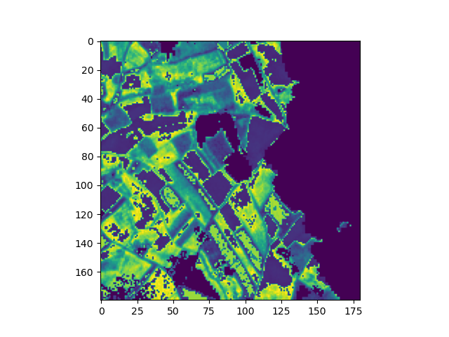
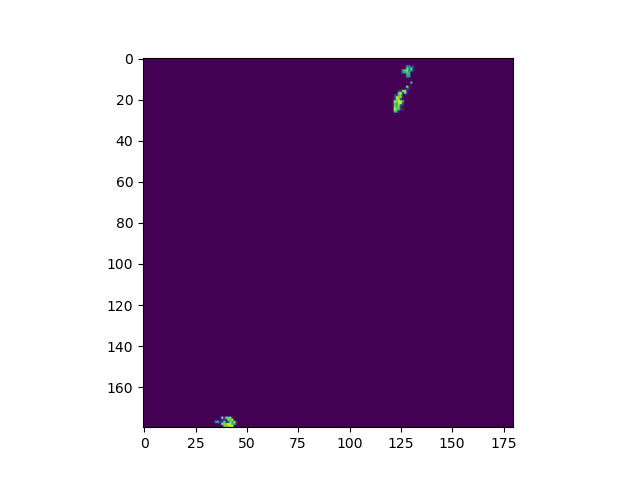
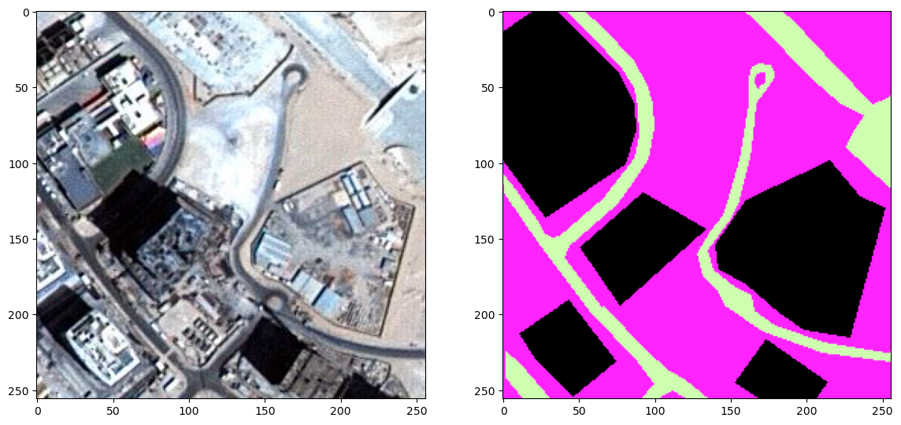

# stelar
Geospatial crop image data analysis

## Dealing with dataset size challenge

Example: 

Full Image: 10980 x 10980

Split images : 180 x 180

|  |  |  |  |
|---|---|--|--|

Example of a different dataset: 

Dubai dataset image example with mask

Thisis the kind of mask we need in Stelar dataset